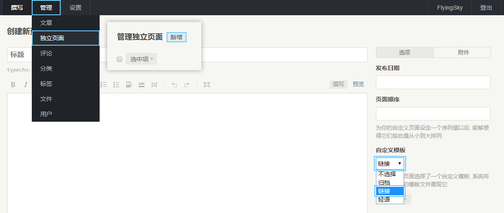
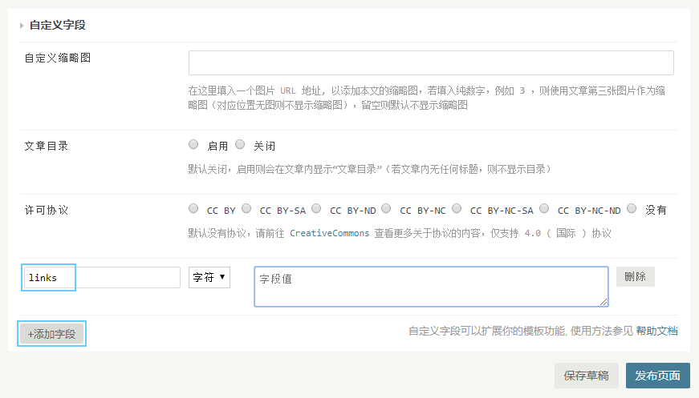

# 链接

亦称为友情链接界面。

## 添加页面

初次使用链接功能，请前往 **网站后台 -> 管理 -> 独立页面 -> 新增页面** 在 **自定义模板** 处选择 **链接** 后创建页面 :

然后新增 **自定义字段** ，字段名称设置为 `links` ，字段值请参照下方分章节 :

## 添加链接

管理链接列表请前往 **网站后台 -> 管理 -> 独立页面** 编辑属于 **链接** 模板的页面，在最下方的 **自定义字段** 的 `links` 内按照以下格式添加即可。

链接输入格式 (带 * 号为必须项) :

    链接名称*,链接地址*,链接描述,链接图标

不同信息之间用英文逗号 `,` 分隔，例如:

    FlyingSky's Blog,https://blog.fsky7.com,每个人的裂痕，最后都会变成故事的花纹。,https://example.ltd/dir/logo.png

若中间有暂时不想填的信息，请留空，例如暂时不想填写 *链接描述* :

    FlyingSky's Blog,https://blog.fsky7.com,,https://example.ltd/dir/logo.png

若结尾有暂时不想填的信息，无需逗号，可直接留空，例如暂时不想填写 *链接描述* 和 *链接图标* :

    FlyingSky's Blog,https://blog.fsky7.com

多个链接换行即可，一行一个。

链接功能使用效果可以预览 [这个页面](https://blog.fsky7.com/links)。